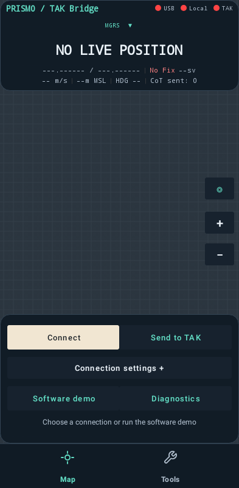
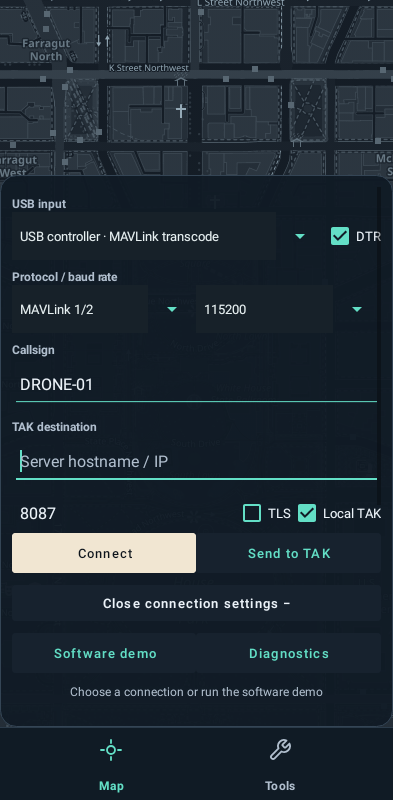
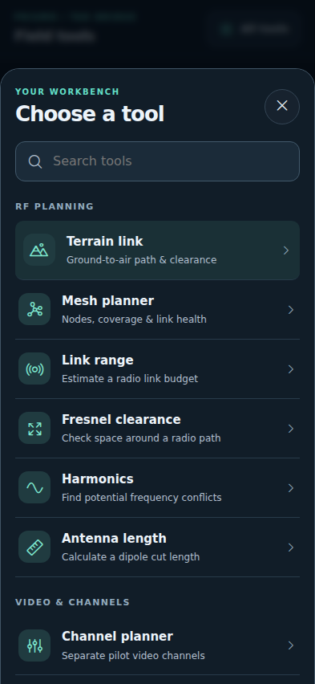
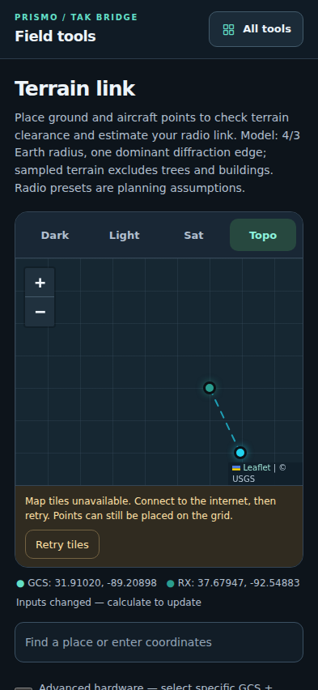
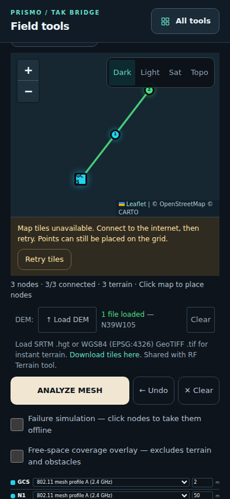

# TAK Bridge User Manual

Prismo / TAK Bridge · Development build 0.4.0

## 01. TAK Bridge

Connect an existing telemetry stream. Read fresh aircraft positions. Verify the result in TAK.

### A calmer Prismo workspace

Map and Tools share a charcoal shell, teal accents and cream primary actions. Connection details open in a scrollable panel.

### Inside this guide

| Page | Section |
| --- | --- |
| 02–03 | Map controls and USB connection |
| 04 | Send positions to TAK |
| 05 | Sessions, freshness and diagnostics |
| 06 | Tools and RF calculations |
| 07 | Terrain link and offline elevation |
| 08 | Mesh planning |
| 09 | Video tools and reference catalogs |
| 10 | Troubleshooting |
| 11 | Units, protocols and reference |

> **Scope** — This guide starts with an existing compatible stream. Device-side feature discovery and activation are outside its scope.

Use the two-page Quick Start for a first session. Physical USB/GPS/TAK acceptance remains pending.

## 02. Map and everyday controls

### 01 / Position first

The top readout shows the chosen coordinate format. Tap the large coordinate to cycle MGRS, decimal degrees, DMS and UTM. Your display choice persists; outgoing CoT always uses decimal degrees.

### 02 / Read the evidence

Fix, satellite count, speed in m/s, altitude in metres MSL and heading describe the source GPS. USB, Local and TAK show connection states. A socket-ready indicator is only one part of verification.

### 03 / Keep the map in view

Use + and − to zoom. Panning releases auto-follow; the follow-aircraft button restores it. A fresh fix adds a heading marker and a breadcrumb trail.

### 04 / Actions within reach

Connect starts a USB session; Stop ends a running bridge. Send to TAK applies the server settings. Software demo exercises parsing and local previews. Diagnostics opens the session counters.

### 05 / Details when needed

Connection settings opens the profile, protocol, baud, callsign and destination fields. Close it to return to the position readout and map controls. Map and Tools remain in the bottom navigation.

> **No live position** — An empty readout is expected before GPS arrives. GPS STALE means publishing has paused; an old map position is not a fresh fix.

## 03. Connect an existing USB stream

### Before connecting

Use Android 8.0 or later with USB host/OTG support and a USB data cable. The source must already emit a supported aircraft GPS stream. Charge-only cables and stick/channel frames cannot provide GPS.

### 1 / Match the stream

Open Connection settings. Choose the generic profile that matches your existing interface, then check protocol and baud. Auto (passive) listens for supported GPS messages. Manual protocol selection is available.

DTR is a USB serial signal, not a GPS indicator. Use the signal setting required by your existing source interface. The Direct FC MSP GPS polling profile alone enables the fixed 2 Hz GPS read request; selecting MSP in a passive profile does not.

### 2 / Name the track

Set a callsign before starting. Callsign, profile, protocol, baud and DTR are locked during an active session; stop the session to change them.

### 3 / Connect and grant access

Close settings and tap Connect. Select a serial port if prompted; the picker identifies it by VID:PID and port index. Approve Android USB access.

### 4 / Confirm GPS

Look for fresh coordinates and a valid fix. A heartbeat, open USB connection or increasing byte count alone does not prove an aircraft GPS downlink.

> **Connection failure** — Check the cable, Android host role, selected serial port and whether the source is actually supplying its configured stream. Reconnect explicitly after a cable disconnect.

## 04. Send positions to TAK

### Local multicast / a receiving client

Before starting USB, open Connection settings and enable Local TAK. The default destination is 239.2.3.1:6969. Configure the receiving client for that group and port, then start a live session with fresh GPS.

Use a network path that carries multicast. Wi-Fi isolation, VPNs and filtering can block delivery. Verify the callsign, position and updates in the receiving TAK client.

### Server TCP / an administrator-provided endpoint

Enter the server hostname or IP and the server port in Connection settings. The default port is 8087; use the actual port supplied for your endpoint. Disable TLS only for an endpoint configured for plaintext TCP. Tap Send to TAK to apply and connect.

### Server TLS / authenticated transport

| Step | Action |
| --- | --- |
| 1 | Enter the hostname or IP and TLS port supplied for your endpoint. The name must match the server certificate. |
| 2 | Enable TLS. Open Certificates and import the client .p12 using its password. |
| 3 | Import the server CA .pem/.crt when needed. Without a separate CA, trust uses the client chain if available, otherwise system trust. |
| 4 | Tap Send to TAK and unlock the client certificate when prompted. Confirm the TAK connection state and then verify the track in the receiving client. |

> **Passwords and process restarts** — Certificate passwords remain in memory and must be entered again after the process ends. Invalid passwords, expired certificates, untrusted servers and hostname mismatches are rejected.

### What a successful send means

The CoT counter records socket writes. It does not acknowledge display in another client. Starting server output alone waits for fresh aircraft GPS; it does not generate a track. Simulated positions never go to the network.

Stop ends the active bridge and its outputs. Configure the desired destinations before reconnecting. Do not treat a connected socket as proof that the full telemetry-to-client path works.

## 05. Sessions, freshness and diagnostics

### Understand the four evidence stages

| Stage | What to check |
| --- | --- |
| USB access | Android permission granted and the chosen serial interface opened. |
| Protocol evidence | Supported frames are decoded. Heartbeats or channels alone are insufficient. |
| Fresh valid GPS | A valid source fix is received within the five-second freshness window. |
| TAK display | The receiving client shows the intended callsign and changing position. |

### Software demo / practice without hardware

Tap Software demo. Recorded-format GPS passes through the telemetry parser and CoT formatter. The demo cycles through fresh positions, a silence interval that becomes stale, and explicit no-fix frames. SIMULATION and local-preview counters identify the mode. Tap Stop demo to end it before connecting live output.

### Background operation and stopping

A foreground service owns the active session. Switching tabs, switching apps or closing the screen leaves it running. Stop from the map or the service notification. Cable loss stops the session and clears its position; reconnect explicitly. After process death, start a new connection.

### Freshness is separate from TAK expiry

Publishing pauses when GPS is invalid or more than five seconds old. GPS STALE replaces the primary readout and disables the marker. Outgoing CoT has a default thirty-second expiry for receiving clients; that expiry is separate from the bridge freshness gate.

### Diagnostics / evidence you can share

Open Diagnostics to inspect connection stages, profile, protocol, baud, byte/frame/error counters, GPS age, output state and local previews. Export writes a JSON report through Android’s file picker.

> **Privacy boundary** — The diagnostics report omits coordinates, identity, destination endpoints and credentials. Terrain and mesh reports can contain planning locations; inspect those exports before sharing.

Map imagery is downloaded and cached separately from telemetry. Cached areas can remain visible offline; an uncached background does not establish GPS or output failure.

## 06. Tools and RF calculations

### Find a task

Open Tools, then All tools. Search by task or choose RF planning, Video & channels, or Flight controllers. The library remembers the last selected tool. Back out of the library to keep working in that panel.

### Link range

Select a radio preset or set frequency, transmit power, antenna gains, receiver sensitivity and fade margin. Read the calculated free-space link budget and range. Enter values using the displayed units.

### Fresnel clearance

Enter frequency and path distances. Inspect the first Fresnel-zone radius and clearance allowance. Clearance depends on the full path; a clear straight line does not prove the zone is unobstructed.

### Antenna length

Choose a frequency, units and velocity factor. Read the suggested dipole dimensions. Material, mounting, nearby objects and tuning change the final result.

### Harmonics

Set the fundamental frequency and analysis band. Inspect harmonic frequencies and potential band overlaps. Results identify frequencies to investigate; they do not measure emissions.

> **Planning estimates** — These calculators use entered assumptions. Range is a model, not a flight limit or measured link guarantee. Check actual hardware values and local conditions before relying on a result.

## 07. Terrain link and offline elevation

### 1 / Place a path

Open Terrain link. Tap once for the ground point and again for the aircraft point; drag either to adjust. Search accepts coordinates, with address search requiring an explicit submission and internet access.

### 2 / Set assumptions

Select compatible radio assumptions, transmit power and heights above ground. Expand advanced settings for antenna gains, fade margin and path sampling. Distinguish AGL inputs from the elevation profile’s ground heights.

### 3 / Supply elevation

Online elevation needs a reachable service. For offline work, import SRTM .hgt files with geographic tile names such as N39W105.hgt, or a geographic WGS84 (EPSG:4326) single-band elevation GeoTIFF. Projected GeoTIFFs are rejected. Cover the complete path with valid elevation data.

### 4 / Read the result

Inspect the elevation profile, line of sight, Fresnel clearance, diffraction and link-budget evidence. Use the trace to inspect individual locations. Missing or invalid elevations stay unknown; they are not silently replaced by flat ground.

### Plan variations

Compare multi-waypoint paths or repeater placement, then generate a report. Undo removes recent placements and Clear starts over. Local elevation is shared with Mesh planner within the Tools session; reimport it when needed after a restart.

> **Two separate data layers** — Map tiles and terrain heights are independent. The free-space coverage overlay excludes terrain and obstacles. A local DEM supports sampled terrain calculations; it does not supply map imagery.

## 08. Mesh planning

### 1 / Build the scenario

Open Mesh planner. Choose the GCS radio assumptions, transmit power, node height AGL and minimum connected-link margin. Tap the map to place radio nodes. Review each node’s settings as the plan grows.

### 2 / Add terrain evidence

Import elevation for the planning area or use a reachable elevation service. HGT and WGS84 GeoTIFF data are shared with Terrain link. Without adequate elevation, terrain-dependent results remain unknown.

### 3 / Inspect links

Review the node list, link matrix, network health and issues. Open a link profile and use its trace to see the sampled path. Compare link margins against the threshold rather than judging a plan from colors alone.

### 4 / Test a failure

Use the node-failure mode to explore loss of a node and the resulting network connections. This is a scenario model; it does not simulate all radio routing, packet loss or interference behavior.

### 5 / Export and review

Export the plan or report using the available actions. Check node coordinates, radio assumptions and any unknown results before sharing. Undo and Clear remove placements when revising a scenario.

> **Coverage overlay** — The coverage shading is a free-space estimate that excludes terrain and obstacles. It is not a measured coverage survey. Inspect terrain profiles and verify the plan on the ground.

## 09. Video tools and reference catalogs

### Channel planner and Closest channel

Channel planner compares video-channel assignments for up to six pilots and flags potential conflicts. Closest channel maps an entered frequency to a nearest listed channel, optionally within a band. Neither tool measures occupied spectrum or actual interference.

### VTX configuration and VTX table

Choose a generic profile, verify frequencies and power values, set the serial/UART details and generate the text. VTX table prepares bands and protocol encoding. Review the complete output before copying.

> **Generated text is a draft** — Copying text does not apply settings to hardware. Check hardware documentation, firmware syntax and frequency/power limits before applying it.

### Flight controller match

Paste existing CLI status or dump text into the matcher. Review the suggested matches and exact target keys. Unrecognized or incomplete input can remain unknown. Clear removes the pasted text.

### Radio firmware references

The radio reference panels provide packet-rate information and searchable receiver/transmitter catalogs. Verify exact upstream keys against your own hardware.

| Action | What it does |
| --- | --- |
| Search / filter | Narrows the bundled catalog; it does not probe connected hardware. |
| Copy | Places generated text or an identifier on the clipboard. Check the success message. |
| Open a source link | Opens the upstream resource when network access is available. |
| Save / share a report | Uses the Android adapter when available; browser-only behavior can differ. |

### Offline and online boundaries

Calculators, libraries and catalogs are bundled. External reference links, address search, uncached map tiles and online elevation need internet access. Local DEM imports provide the supported offline elevation path.

## 10. Troubleshooting

| Symptom | Check next |
| --- | --- |
| No USB serial interface | Use a data cable and Android USB host/OTG. Check the selected source interface. |
| Permission denied | Tap Connect again and approve Android access. |
| USB open; no bytes | Check the port, profile, baud and whether the existing source is emitting its stream. |
| Frames; no fresh GPS | Confirm a valid source fix. Heartbeats and stick/channel frames are not aircraft GPS. |
| GPS STALE | Fresh position updates have stopped. Inspect the source and cable before resuming. |
| Socket sends; no TAK marker | Check client input, group/port or server settings, network filtering and callsign. |
| TLS rejected | Check password, dates, CA trust and certificate hostname/IP match. |
| Missing map / terrain | Check tile access and elevation separately; import a valid local DEM. |

### Diagnose in order

Start with USB access, then incoming frames, then fresh valid GPS, then output and finally the receiving client. Changing several settings at once makes the result harder to interpret.

### Capture a useful report

Open Diagnostics immediately after reproducing the issue. Export the JSON counters, record the app version and describe the expected versus observed behavior. Include whether you were using Software demo or a real stream.

> **Share deliberately** — The diagnostics report omits coordinates and credentials. Planning reports can contain locations. Inspect screenshots and exports before sharing.

After a cable disconnect or process restart, reconnect explicitly. End the demo before attempting live output. A previous track on a receiving client may remain visible until its CoT expiry.

## 11. Units, protocols and reference

### Units and defaults

| Item | Meaning / default |
| --- | --- |
| GPS display | Speed m/s; altitude metres MSL; heading degrees. |
| Terrain / mesh heights | Metres AGL above the local ground surface. |
| RF inputs | Frequency MHz; power mW or dBm as labeled; gains dBi; margins dB. |
| USB / multicast / server | 115200 baud; 239.2.3.1:6969 multicast; TCP 8087. Match your interface/endpoint. |
| Position / CoT timing | GPS freshness 5 s; default publish interval 1 s; receiving-client CoT expiry 30 s. |
| Altitude in CoT | MSL appears in remarks; HAE remains unknown without a geoid conversion. |

### Supported stream families

| Protocol | Bridge behavior |
| --- | --- |
| MAVLink v1/v2 | Requires an existing supported GPS stream. |
| MSP v1/v2 | Passive reception, or fixed GPS polling only in the explicit Direct FC profile. |
| GHST / CRSF | Receives supported GPS frames from an existing compatible stream. |
| Auto (passive) | Listens across the parsers; decoded GPS establishes the protocol. |

### Validation and project reference

Software checks cover telemetry, lifecycle, TCP/TLS, layout, navigation and calculations. Physical USB/GPS/TAK acceptance remains pending. See V1_READINESS.md for acceptance and release signing.

Project: github.com/DroneWuKong/MultiProtocol-UAS-TAK-Bridge. Source identifiers and license attribution are retained.
